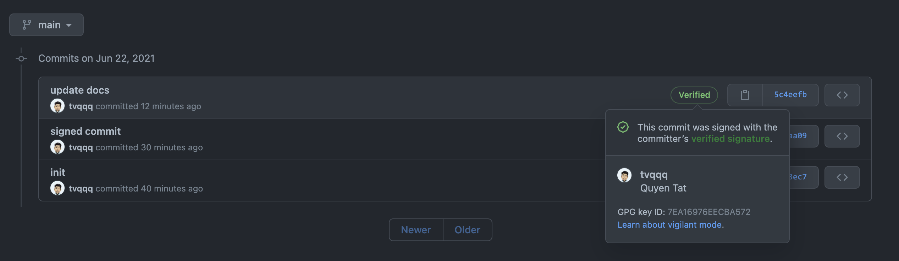

— — —

## @see:

- https://www.youtube.com/watch?v=1vVIpIvboSg
- https://nickjanetakis.com/blog/creating-and-managing-a-gpg-key-pair#cheatsheet
- https://gist.github.com/paolocarrasco/18ca8fe6e63490ae1be23e84a7039374
- https://stevescargall.com/2020/02/04/a-quick-guide-to-signing-your-git-commits

## Generate key

- `brew install gnupg` (MacOS x Brew)

- `gpg --list-keys`

- `gpg --full-generate-key` (Pick RSA / RSA (1), 4096 bits and choose an expiration date (1y))

- `gpg --export --armor nick@example.com`

- Paste the key into Github account settings (https://github.com/settings/keys)

## Signed on every commit`

- `git config --global gpg.program "/usr/local/bin/gpg"`

- `git config user.signingkey nick@example.com` or use the ID in list-keys

- `git config commit.gpgsign true`

- `export GPG_TTY=$TTY` (add into `~/.zshrc`)

- `git log --show-signature`
